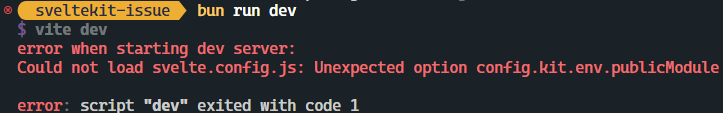

# [sveltekit Issue #13385](https://github.com/sveltejs/kit/issues/13385)
This repository is a reproduction for the issue.

## How to reproduce
For bun:
```sh
$ bun install
$ bun run dev
```
For npm:
```sh
$ npm install
$ npm dev
```
The `dev` script errors with the following:

